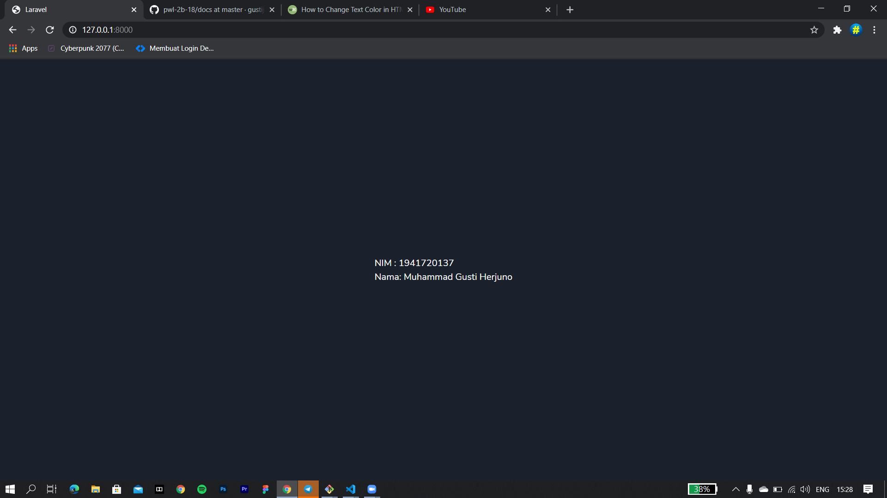

# 01 - Hello World

## Tujuan Pembelajaran

1. Mahasiswa mampu melakukan instalasi dan konfigurasi laravel
2. Mahasiswa mampu mengubah tampilan di halaman ralavel

## Hasil Praktikum

Tampilan setelah merubah untuk NIM dan Nama

 [kode Program](../../src/01_hello_world/welcome.blade.php)