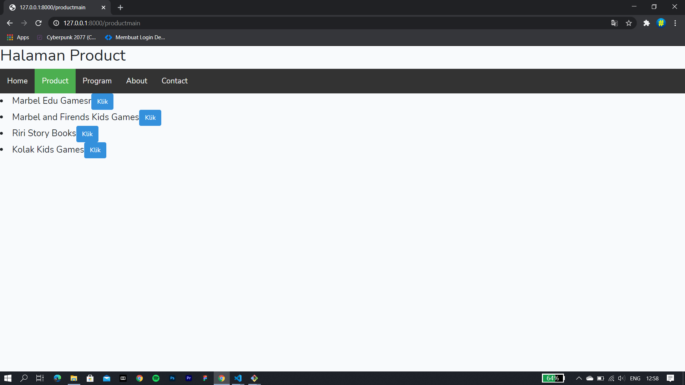
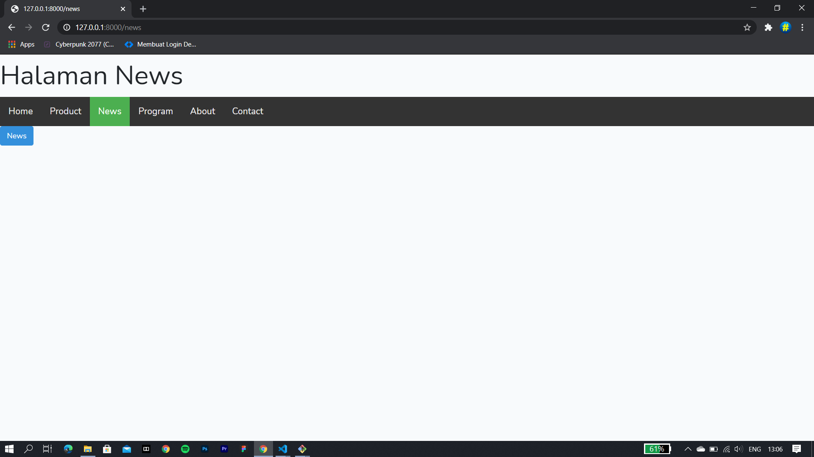
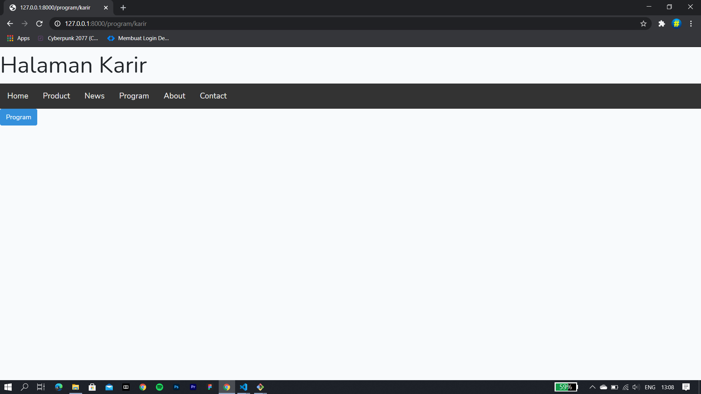
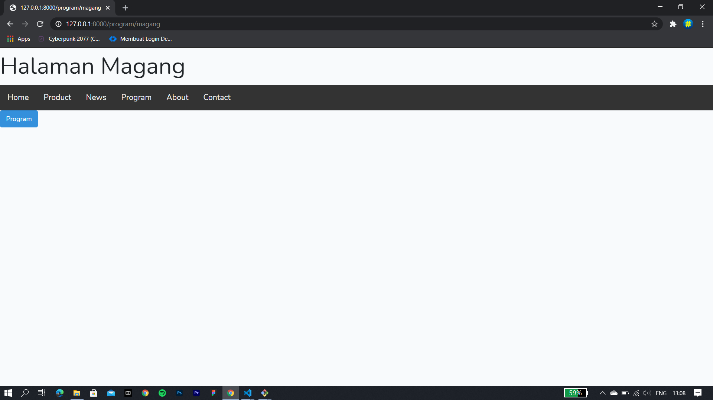
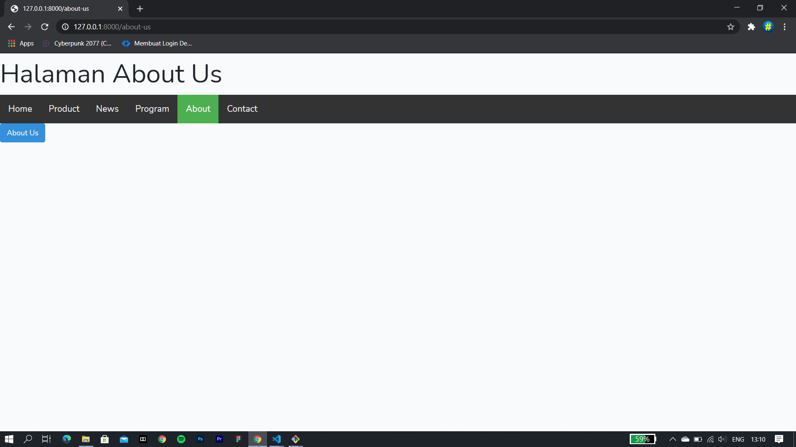
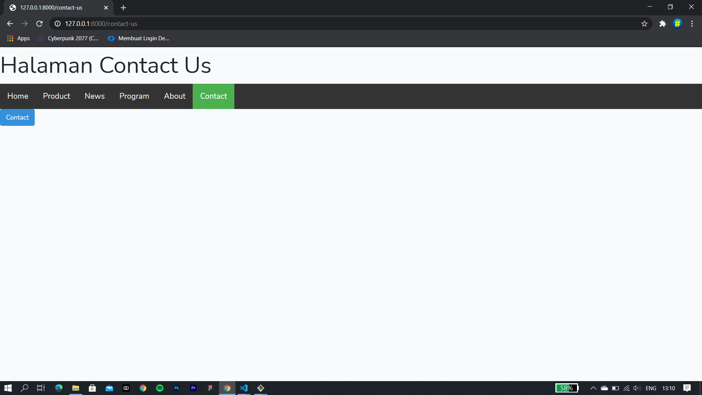

# 03 - View

## Tujuan Pembelajaran

1. Mahasiswa memahami konsep routing Lavarel Web Framework
2. Mahasiswa menerapkan routing pada Laravel web Framework
3. Mahasiswa mehamami konsep controller Laravel Web Framework
4. Mahasiswa menerapkan controller pada Laravel Web Framework
5. Mahasiswa memahami konsep views Laravel Web Framework
6. Mahasiswa menerapkan konsep views Laravel Web Framework

## Hasil Praktikum

### Praktikum 1:
### HALAMAN HOME

### HALAMAN PRODUCTS

Marbel Edu Games

Marbel and Friends Kids Game

Riri Story Books

Kolak Kids Songs

### HALAMAN NEWS

### HALAMAN PROGRAM

Karir

Magang

Kunjungan Industri

### HALAMAN ABOUT-US

### HALAMAN CONTACT-US

### KODE PROGRAM
ROUTES 
[kode Program(web)](../../src/03_view/web.php) 
CONTROLLER 
[kode Program(AboutusController)](../../src/03_view/Controller/AboutusController.php) 
[kode Program(ContactController)](../../src/03_view/Controller/ContactController.php) 
[kode Program(HomeController)](../../src/03_view/Controller/HomeController.php) 
[kode Program(ProductController)](../../src/03_view/Controller/ProductControllerr.php) 
[kode Program(NewsController)](../../src/03_view/Controller/NewsController.php) 
[kode Program(ProgramController)](../../src/03_view/Controller/ProgramController.php) 
VIEWS 
[kode Program(about-us)](../../src/03_view/views/about-us.blade.php) 
[kode Program(contact-us)](../../src/03_view/views/contact-us.blade.php) 
[kode Program(home)](../../src/03_view/views/home.blade.php) 
[kode Program(news)](../../src/03_view/views/news.blade.php) 
[kode Program(product)](../../src/03_view/views/product.blade.php) 
[kode Program(productmain(halaman utama))](../../src/03_view/views/productmain.blade.php) 
[kode Program(program)](../../src/03_view/views/program.blade.php) 
[kode Program(programmain(halaman utama))](../../src/03_view/views/programmain.blade.php) 
LAYOUTS 
[kode Program(header)](../../src/03_view/views/Layouts/header.blade.php) 

