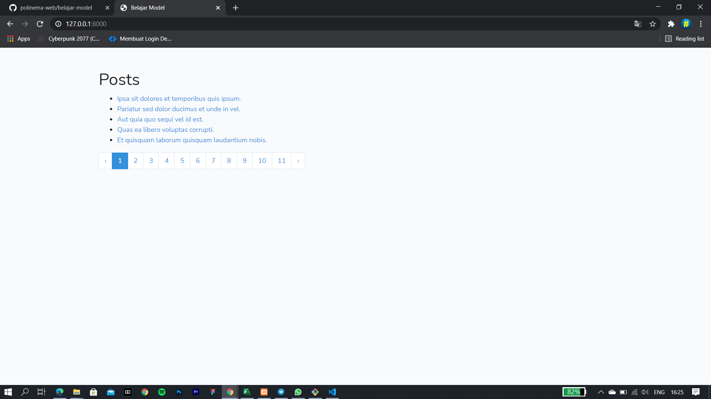

# 04 - model

## Tujuan Pembelajaran

1. Mahasiswa mampu melakukan migration
2. Mahasiswa mampu melakukan seeder
3. Mahasiswa mamu menampilkan data dari database
4. Mahasiswa mampu memahami konsep model

## Hasil Praktikum

Tampilan halaman utama

[kode Program](../../src/05_autentikasi/cms)