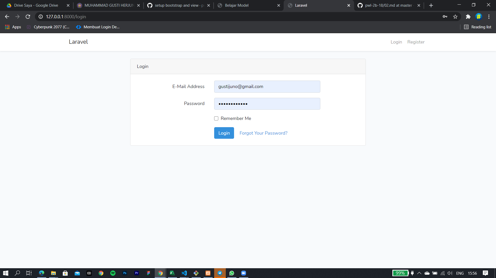
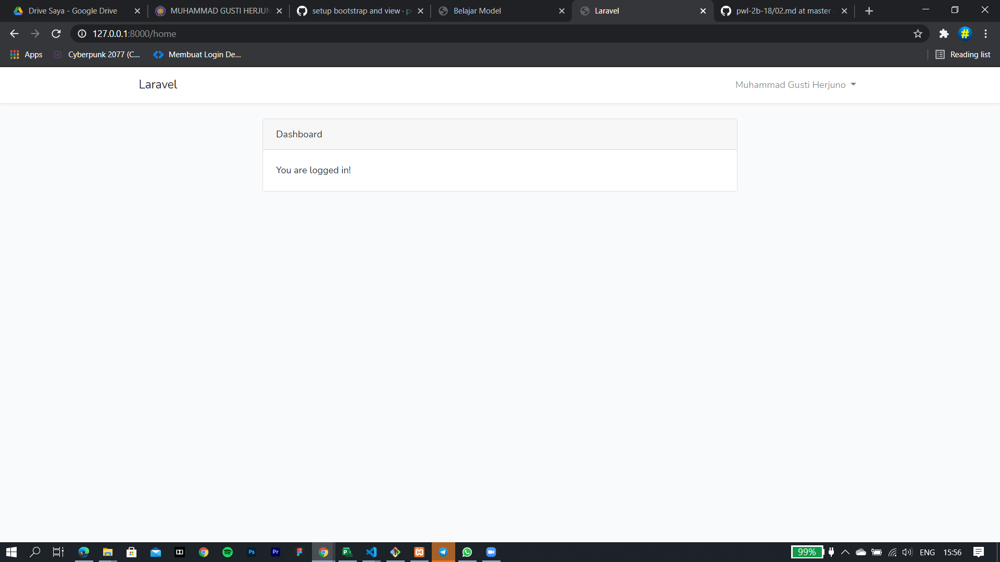
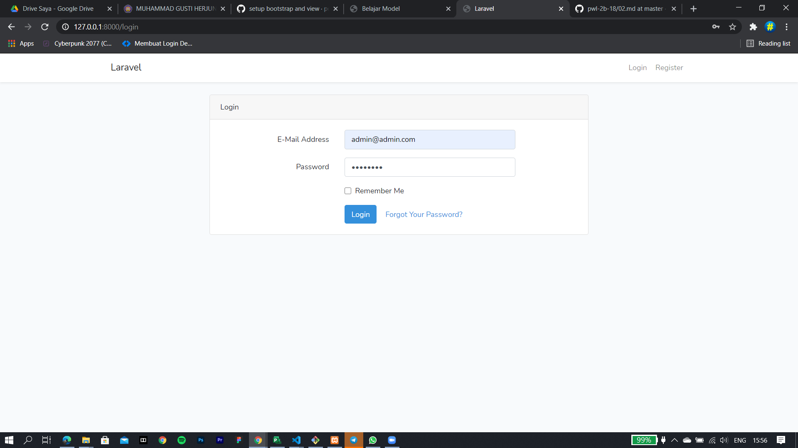
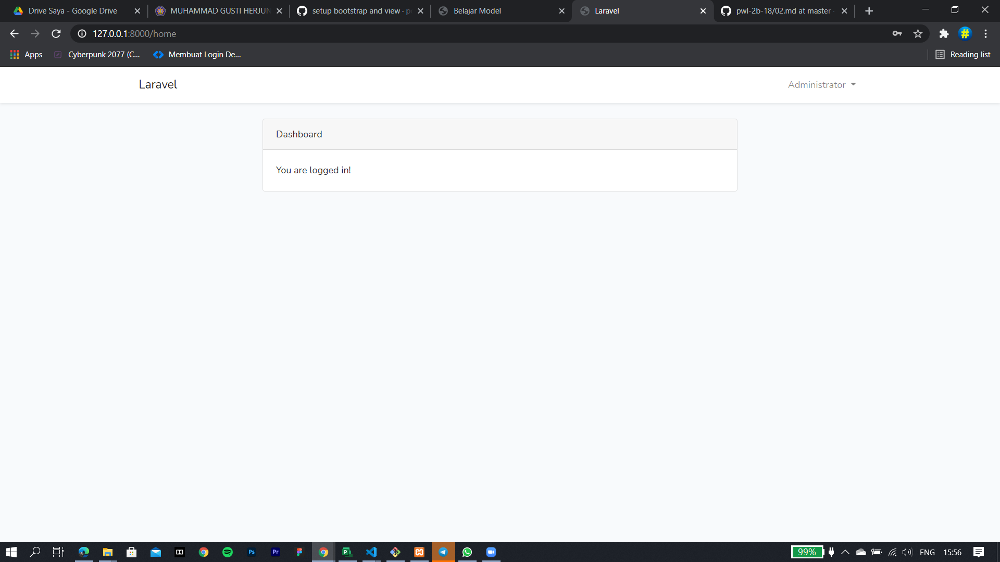
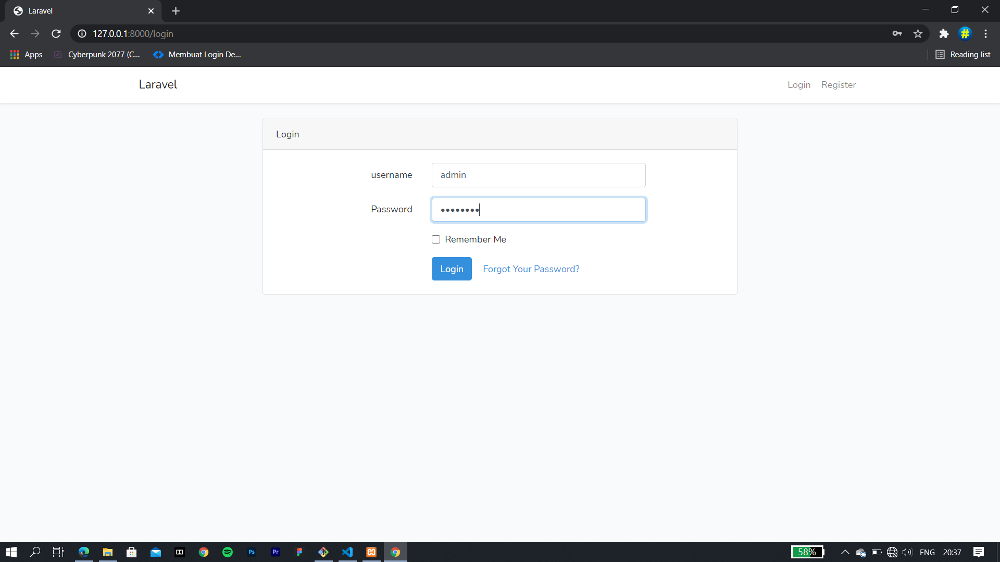
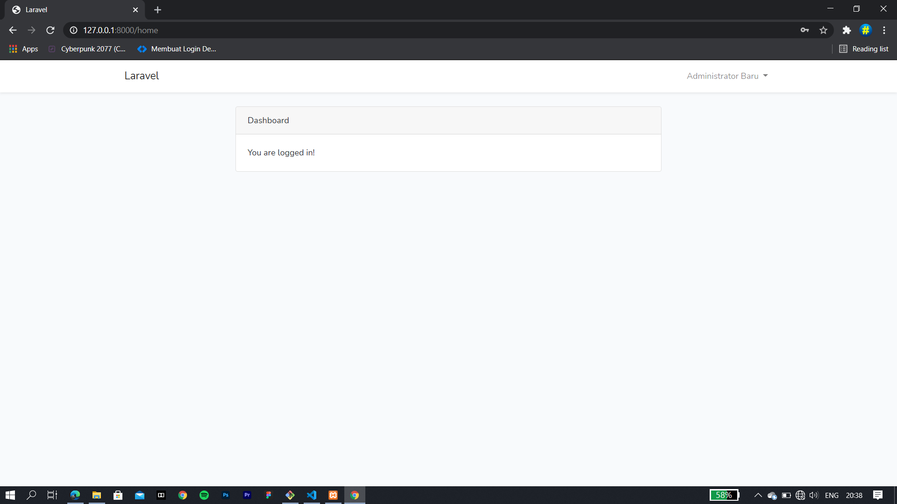
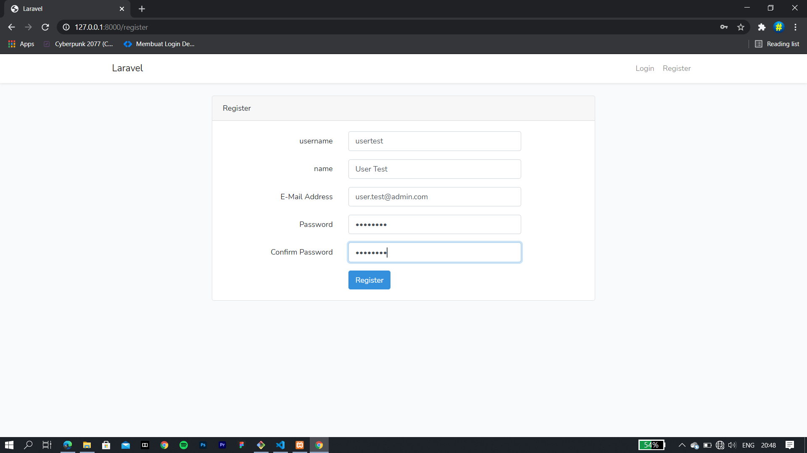
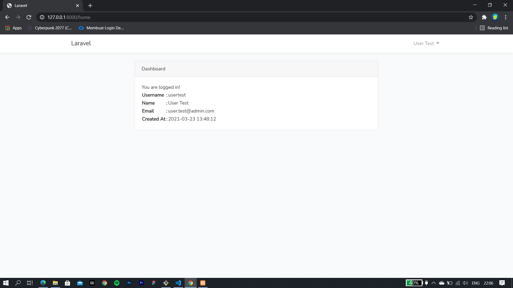

# 05 - autentikasi

## Tujuan Pembelajaran

1. Mahasiswa mampu melakukan migration
2. Mahasiswa mampu melakukan seeder
3. Mahasiswa mamu menampilkan data dari database
4. Mahasiswa mampu memahami konsep model
5. Mahasiswa mampu membuat form login dan register

## Hasil Praktikum

## PRAKTIKUM 1

Login menggunakan data pribadi

Login menggunakan data admin

## PRAKTIKUM 2

Login menggunakan username

Register dengan menambahkan username

Hasil profil yang diregister

[kode Program](../../src/06_autentikasi/cms)