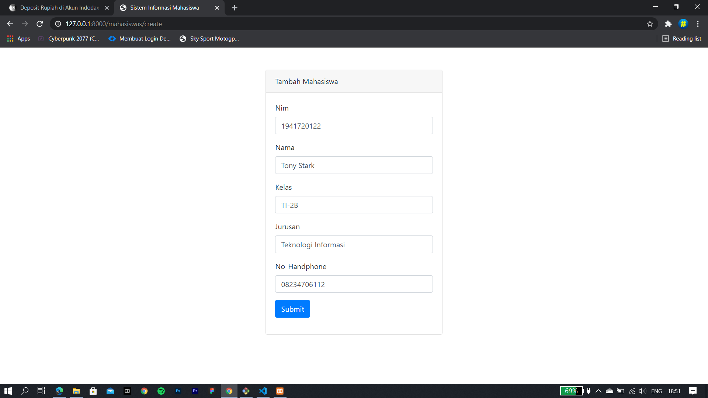
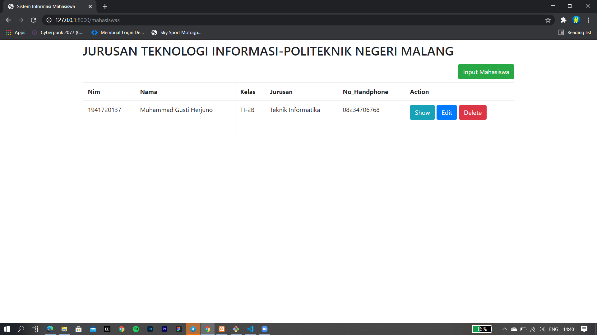
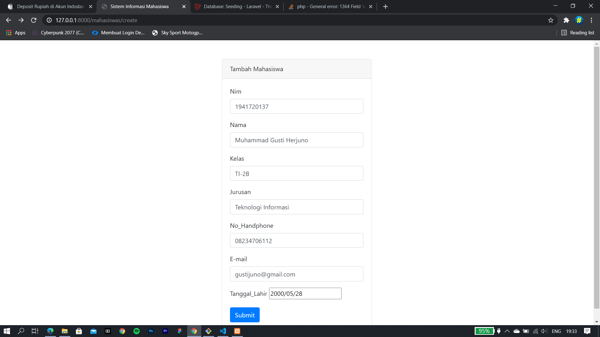
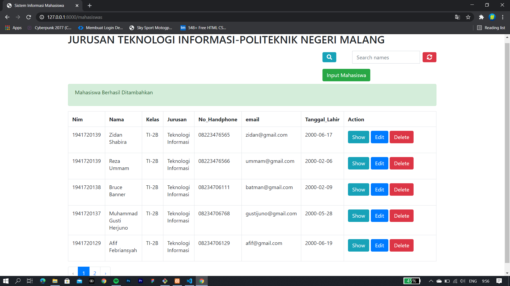
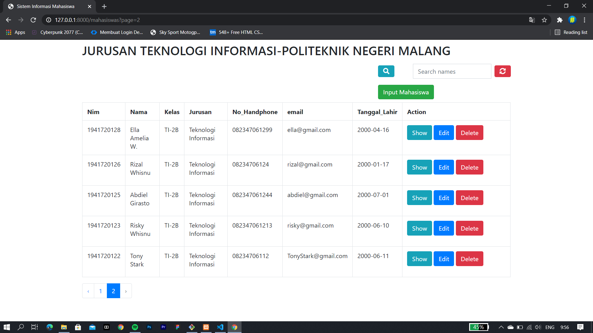
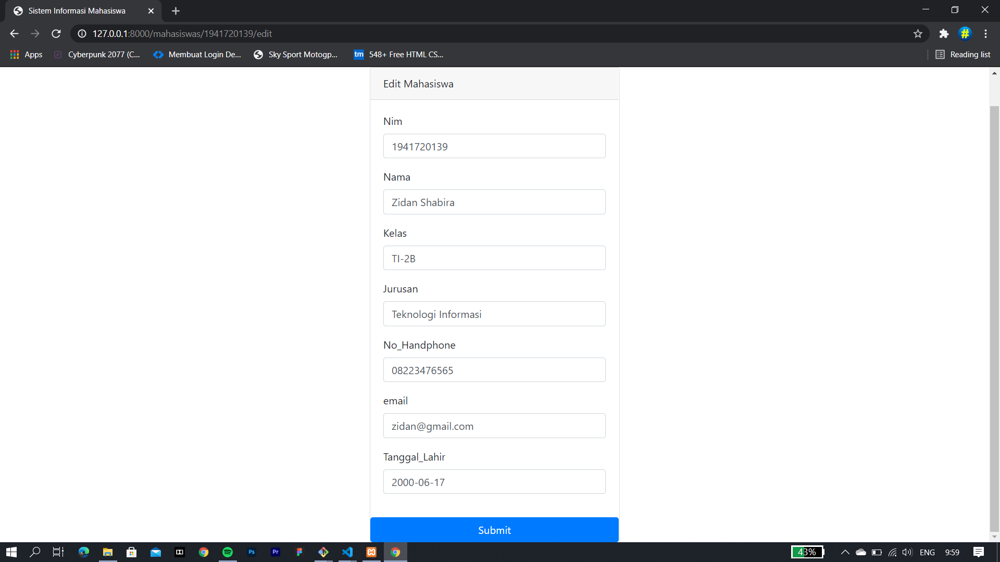
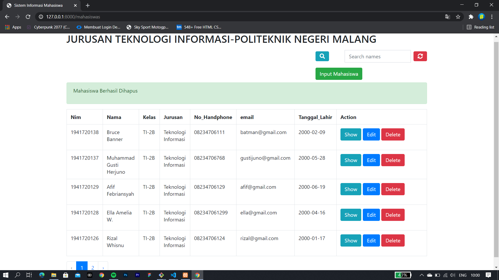
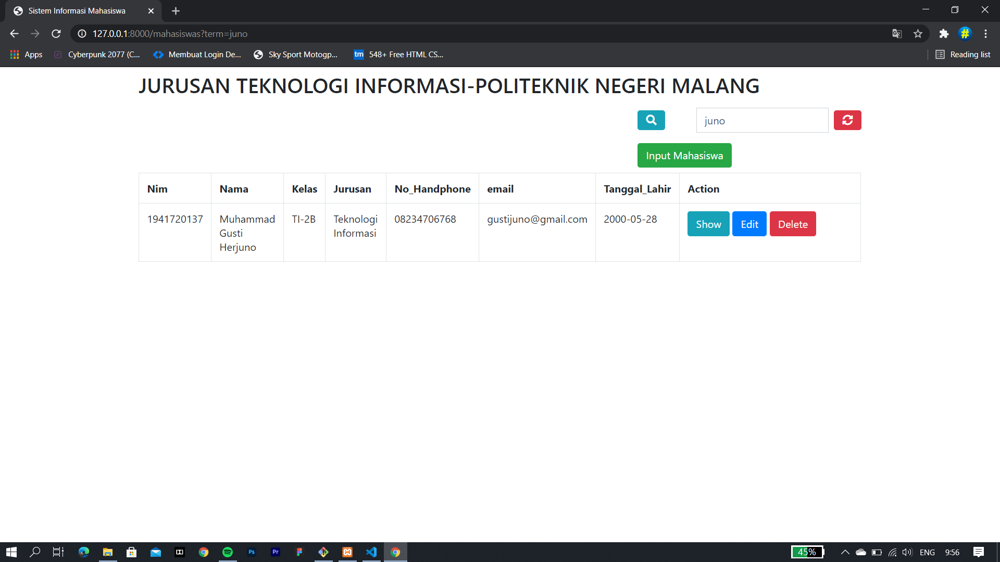

# 06 - orm eloquent dan crud

## Tujuan Pembelajaran

1. Mahasiswa mampu melakukan migration
2. Mahasiswa mampu melakukan seeder
3. Mahasiswa mamu menampilkan data dari database
4. Mahasiswa mampu memahami konsep orm eloquent
5. Mahasiswa mampu memahami konsep orm crud

## PRAKTIKUM 
Tampilan input mahasiswa

Tampilan setelah input data mahasiswa

## TUGAS PRAKTIKUM
Tampilan input mahasiswa

Tampilan setelah input data mahasiswa (**halaman 1**)

Tampilan setelah input data mahasiswa (**halaman 2**)

Tampilan show

Tampilan edit

Tampilan delete

Fitur search

[kode Program](../../src/06_orm_eloquent_crud/mahasiswa)
