# UTS

## 1. menerapkan class model, view, controller, dan router

* [kode program Model](../../src/08_UTS/app/Models)
* [kode program Controller](../../src/08_UTS/app/Http/Controllers)
* [kode program router](../../src/08_UTS/routes/web.php)
* [kode program view](../../src/08_UTS/resources/views)

## 2. Menerapkan sistem login dan register, dan dapat logi menggunakan email dan username

* **Tampilan halaman login**
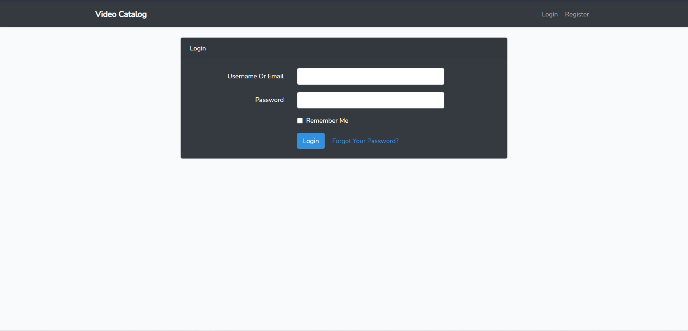
Di web ini dapat login menggunakan email atau username yang sudah terdaftar di database

* **Tampilan halaman register**
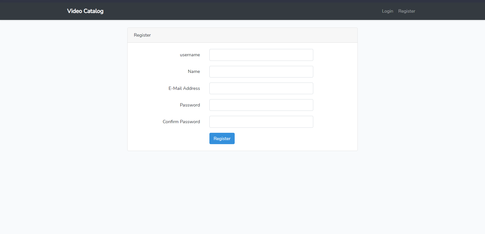
user harus mengisi semua supaya terdaftar pada database

* **Tampilan tabel user database**
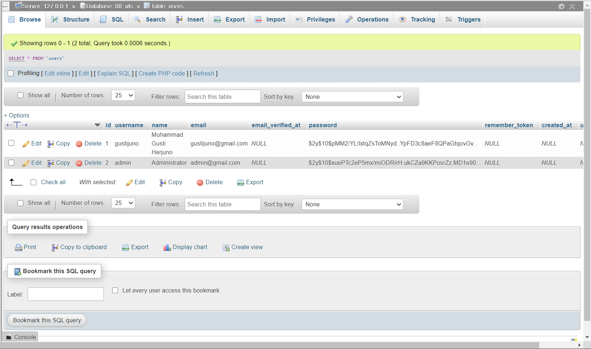
Terdapat dua user, pertama user sebagai pengguna kedua adalah admin yang dapat merubah isi dari website

## 3. Menampilkan dashboard profil yang dapat di edit
* **Tampilan halaman profil**
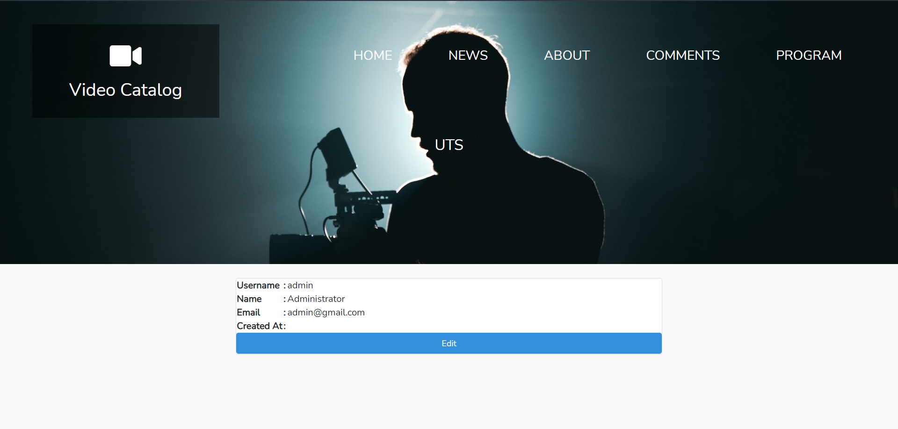
Di halaman tersebut menmpilkan username, nama, dan email
* **Tampilan halaman edit profil**
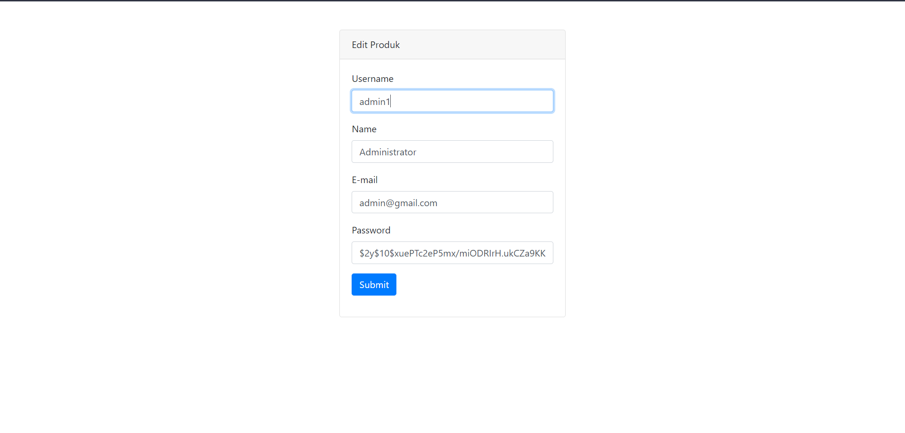
dalam kasus tersebut username admin yang sebelumnya adalah "admin" menjadi "admin1". Dan username user admin akan berubah seperti gambar dibawah :
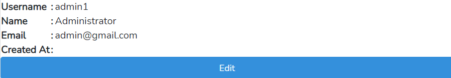

## 4.  Menerapkan operasi CRUD dengan ORM pada konten web
* **Tampilan halaman product (admin)**
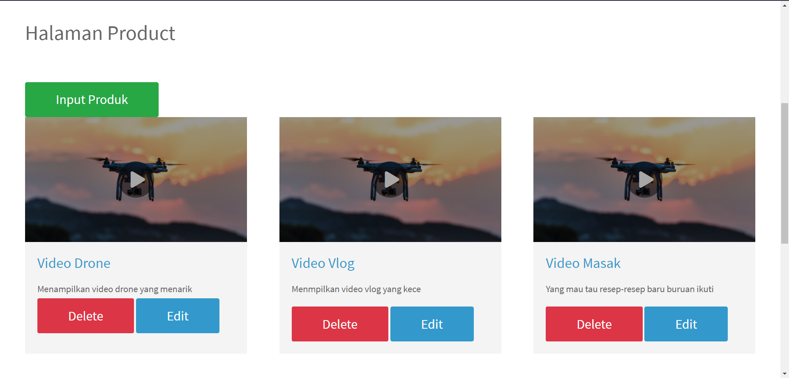
Di halaman tersebut terdapat produk-produk yang dapat di tambah,edit,hapus
* **Tampilan halaman product (user)**
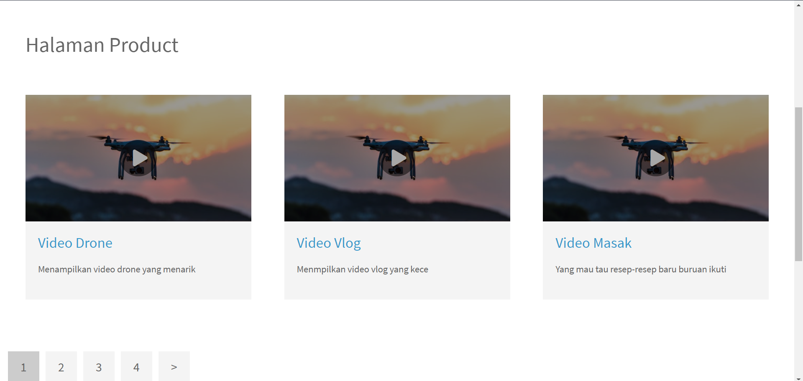
* **Contoh menambah produk**
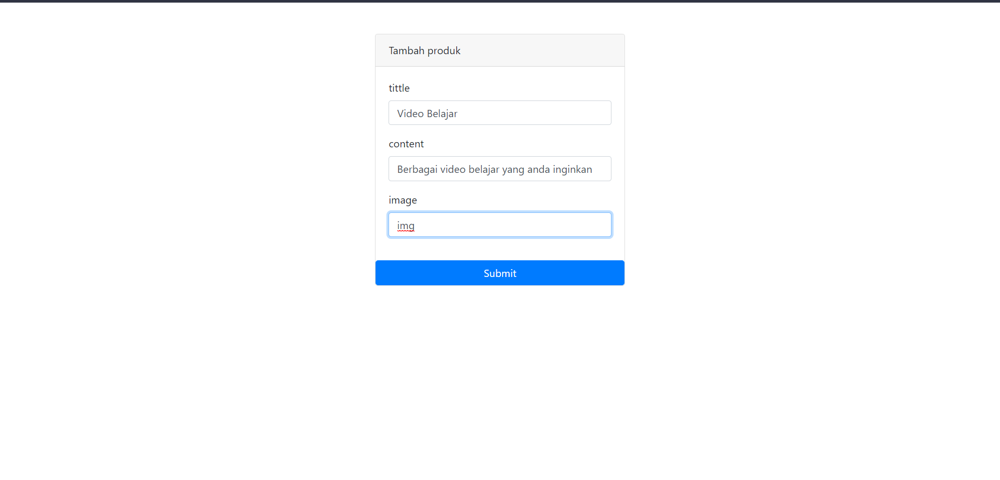
Dalam menu tambah produk terdapat isian judul, dan deskripsi. Kendala dalam pengisian produk adalah beum bisa menambahkan gambar produk.Jika berhasil akan muncul produk baru seperti gambar di bawah :
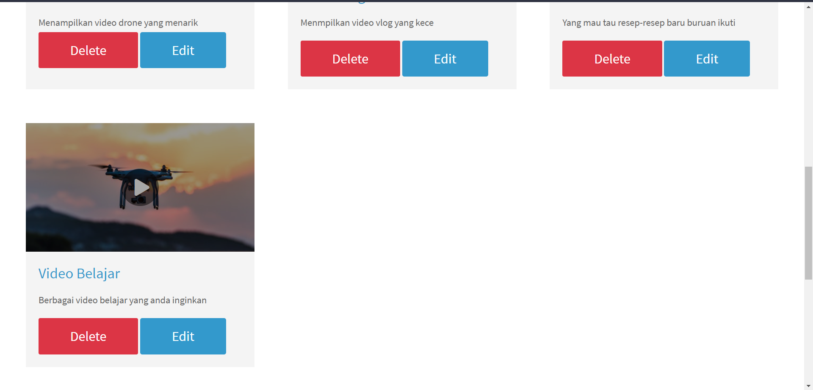
* **Contoh edit produk**
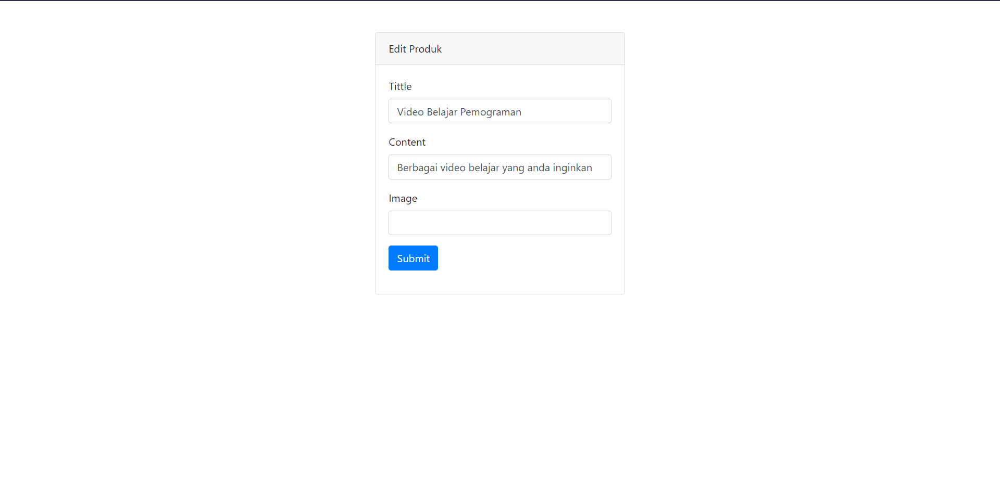
Disana akan merubah judul yang sebelumnya "Video Belajar", akan diubah menjadi "Video Belajar Pemograman". Jika berhasil hasilnya akan seperti gambar dibawah :
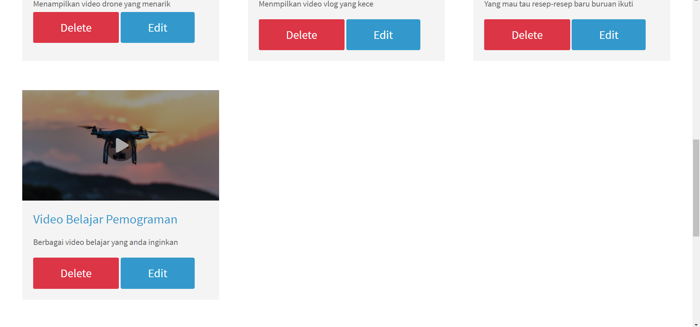
* **Contoh hapus produk**
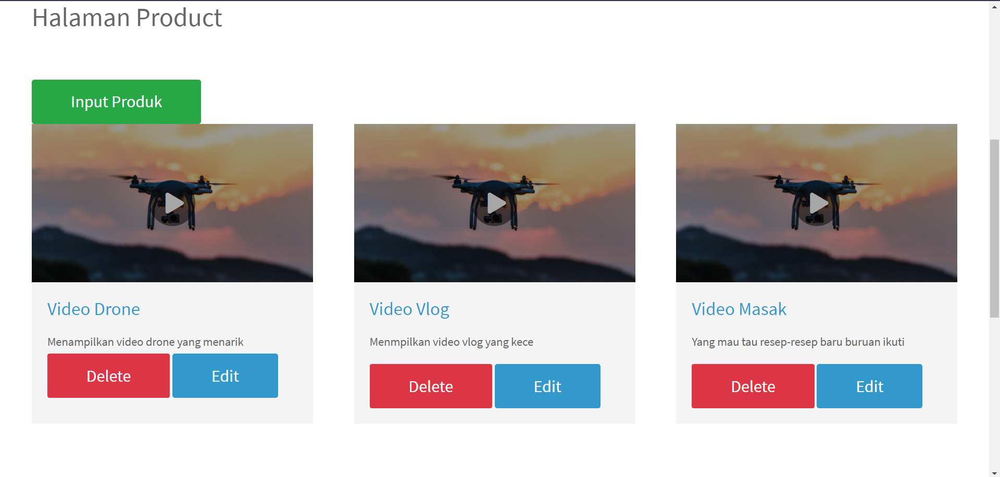
Yang sebelumnya ada produk video belajar, setelah menekan button delete maka produk tersebut akan terhapus
* **Tabel database dari produk**
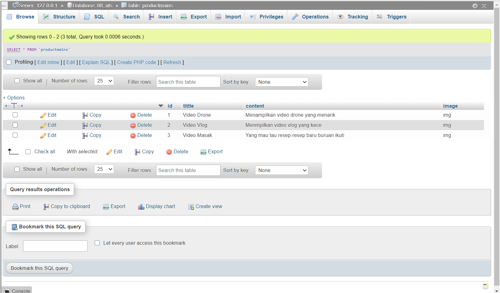
* **Fitur komentar**
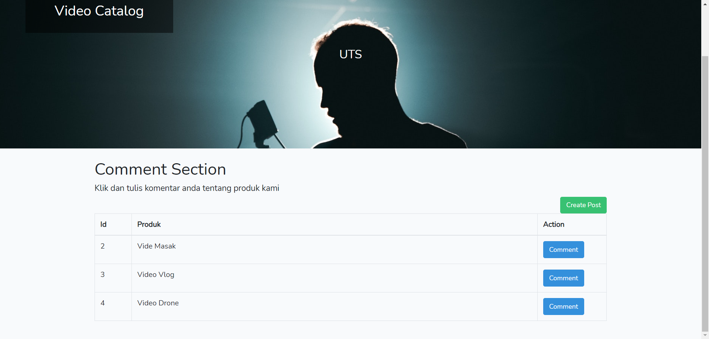
disana terdapat list produk dari web tersebut.User bisa memilih produk mana yang akan user pilih untuk di komentari dengan klik button "comment". Contoh dibawah adalah contoh dari fitur komentar:
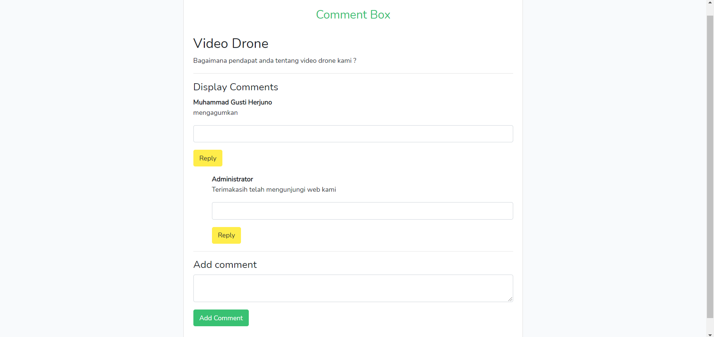
disana terdapat komentar dari user umum yang di reply oleh admin
* **Database tabel dari fitur komentar**
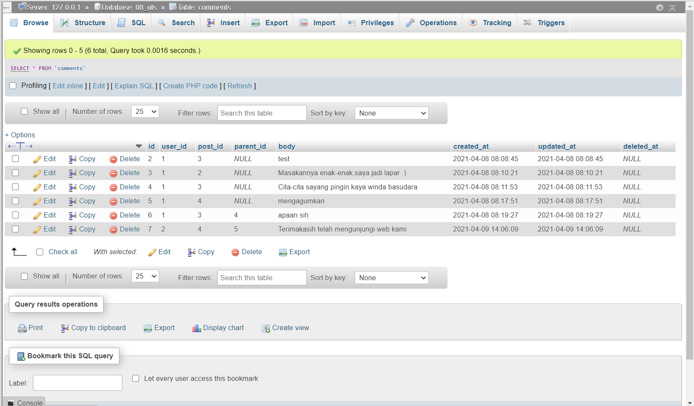

