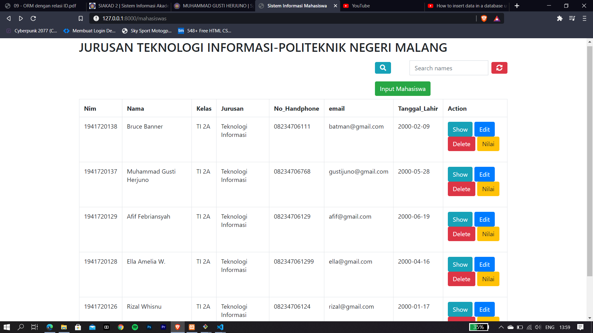
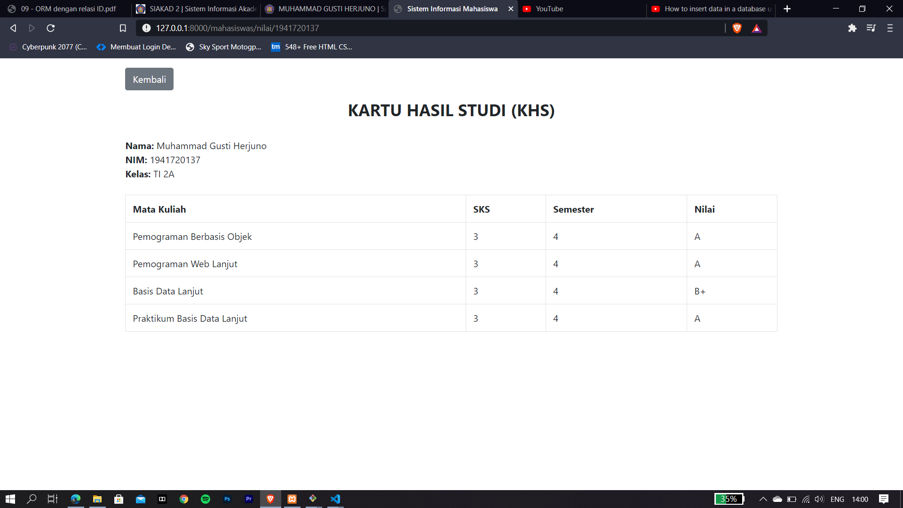
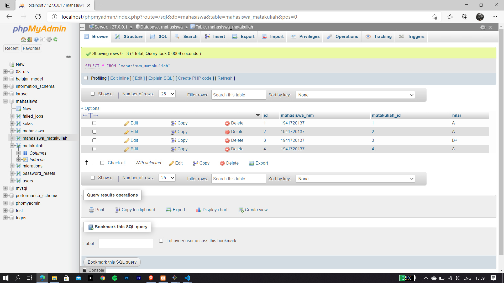

# 09 - orm relsi

## Tujuan Pembelajaran

1. Mahasiswa mampu melakukan migration
2. Mahasiswa mampu melakukan seeder
3. Mahasiswa mamu menampilkan data dari database
4. Mahasiswa mampu memahami konsep orm relasi
5. Mahasiswa mampu memahami konsep one to many di database
6. Mahasiswa mampu memahami konsep many to many di database

## PRAKTIKUM 
* **Tampilan input mahasiswa setelah ditambah form kelas**

* **Tampilan setelah input data mahasiswa bernama felix**

* **Tampilan menu show**

* **Tampilan menu edit**   
disana mencoba mengganti kelas yang sebelumnya kelas B menjadi kelas C

Tampilan setelah mahasiswa bernama felix berganti kelas menjadi kelas C
 

 ## LATIHAN
 Menambahkan button nilai untuk melihat nilai dari salah satu mahasiswa
 
 Isi dari tampilan nilai dari salah satu mahasiswa
 
 Untuk mengisi datanya masih harus manual melalui phpmyadmin, dan 1 mahasiswa yang diwakili oleh foreign key Nim dapat memiliki banyak matkul_id

 [kode Program](../../src/09_orm_relasi)
