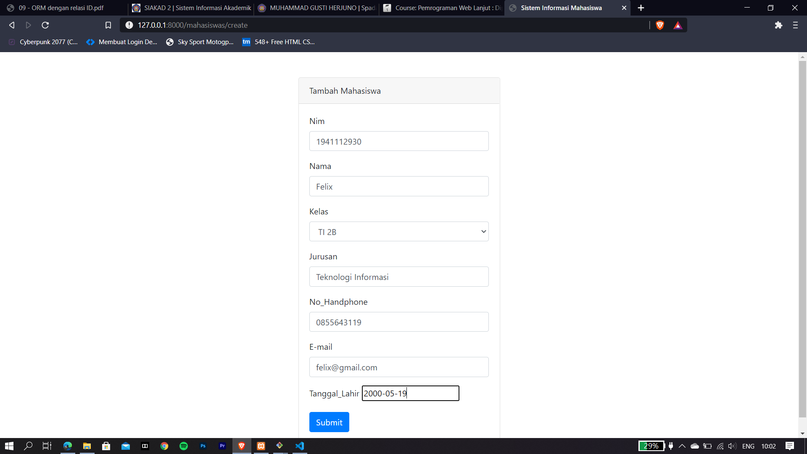
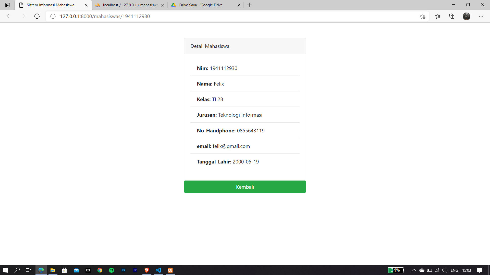
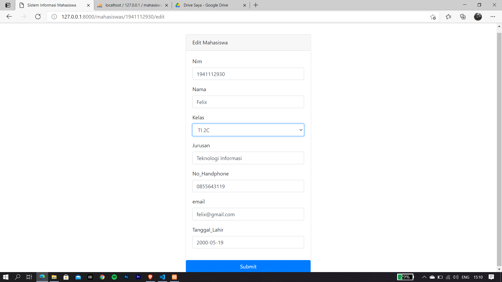
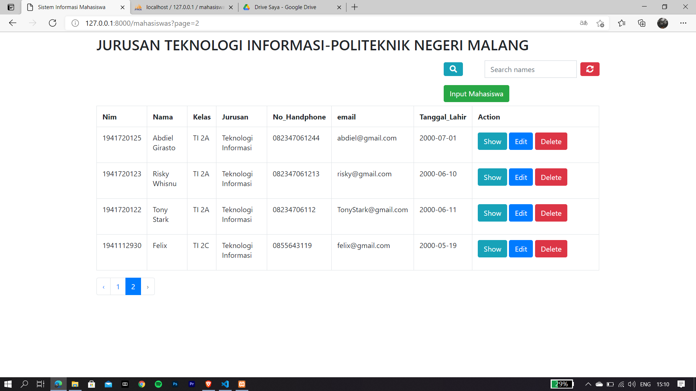

# 09 - orm relsi

## Tujuan Pembelajaran

1. Mahasiswa mampu melakukan migration
2. Mahasiswa mampu melakukan seeder
3. Mahasiswa mamu menampilkan data dari database
4. Mahasiswa mampu memahami konsep orm relasi
5. Mahasiswa mampu memahami konsep join di database

## PRAKTIKUM 
Tampilan input mahasiswa setelah ditambah form kelas

Tampilan setelah input data mahasiswa bernama felix

Tampilan menu show

Tampilan menu edit, disana mencoba mengganti kelas yang sebelumnya kelas B menjadi kelas C

Tampilan setelah mahasiswa bernama felix berganti kelas menjadi kelas C
 

 [kode Program](../../src/09_orm_relasi)
