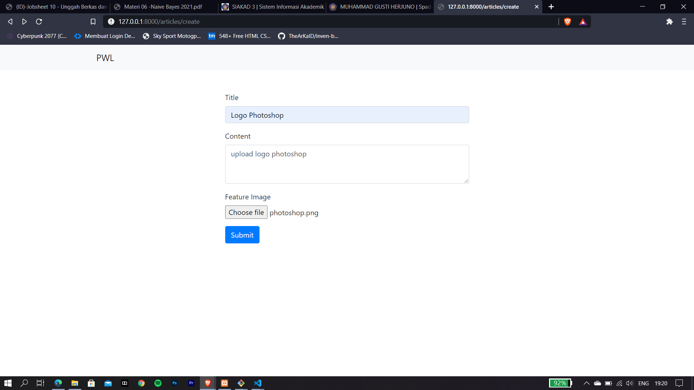
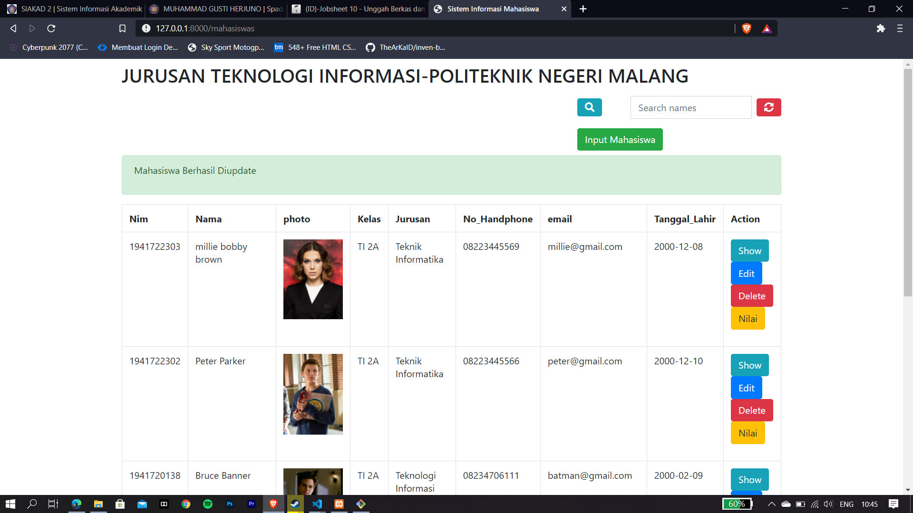

# 10 - Upload File dan PDF Export

1. Mahasiswa mampu melakukan upload file
2. Mahasiswa mampu menampilkan file yang sudah di upload
3. Mahasiswa mampu melakukan export sebuah halaman web menjadi PDF

## PRAKTIKUM 1
**Melakukan upload sebuah file yang disini menggunakan format gambar**
* Memilih gambar yang akan di upload

* Memastikan form terisi dengan benar

* Jika sudah berhasil maka akan muncul halaman seperti dibawah

* Tampilan database jika data sudah tersimpan

## PRAKTIKUM 2
**Melakukan update data yang sudah tersimpan**
* Melakukan perubahan data termasuk pada file gambar

* Jika sudah berhasil maka akan muncul tampilan seperti dibawah

* Tampilan database pasca update data

## PRAKTIKUM 3
**Membuat Fitur Export PDF**
* Hasil export PDF yang sudah dibuat tampilannya di views

## TUGAS
**Menambah kolom gambar**
* Tampilan input mahasiswa setelah ditambah form untuk upload foto

* Tampilan index saat ditambah kolom foto

* Melakukan edit di mahasiswa bernama peter parker

* Tampilan database setelah ditambah kolom untuk foto

**Mencetak PDF**
* Tampilan cetak PDF di salah satu mahasiswa

* Jika sudah tercetak/terdownload maka tampilannya akan seprti dibawah

[kode Program](../../src/10_UploadFile_PDFExport)

