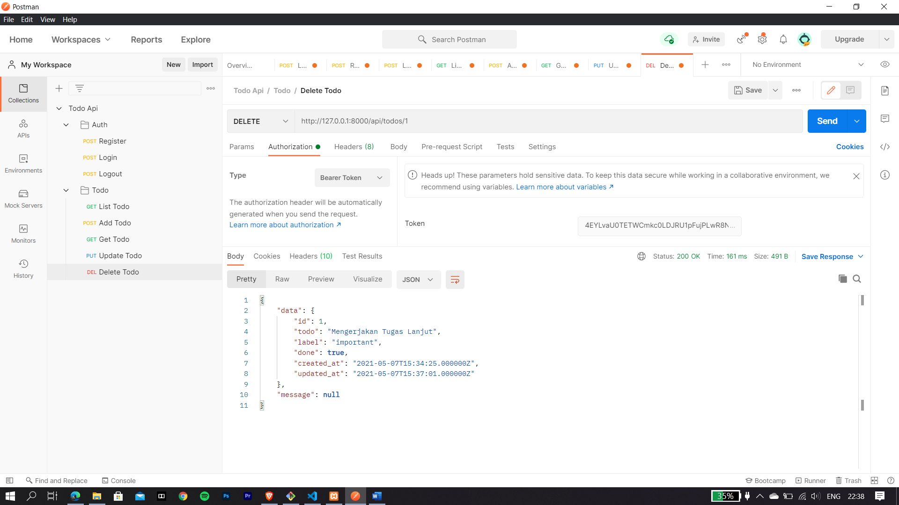

# 11 - RESTful API

1. Mahasiswa memahami konsep RESTful API
2. Mahasiswa mampu membangun autentikasi token pada RESTful API
3. Mahasiswa mampu membangun CRUD dengan RESTful aPI

## PRAKTIKUM 1
**Melakukan Register,Login,Logout menggunakan Postman**

* Melakukan register dengan data dummy yang lansung terhubung dengan tabel user yang berada di database

* Melakukan login dengan data yang suda di register sebelumnya, saat login akan muncul token yang berguna untuk logout maupun CRUD

* Melakukan Logout dengan menggunakan token yang didaoat dari proses login tadi, dan fungsi logout adalah untuk mematikan token login supaya tidak dapat dipakai kembali

* Isi dari tabel user

## PRAKTIKUM 2
**Melakukan CRUD menggunakan Postman**

* Melakukan List Todo

* Melakukan Add Todo

* Melakukan Get Todo

* Melakukan Update Todo, Yang semula 'Mengerjakan Tugas' menjadi 'Mengerjakan Tugas Lanjut'

* Data di tabel setelah di update

* Melakukan Delete Todo

* Setelah melakukan Delete Todo maka data yang berada di tabel todos akan terhapus

[kode Program](../../src/11_RESTful_API/todo-api)

